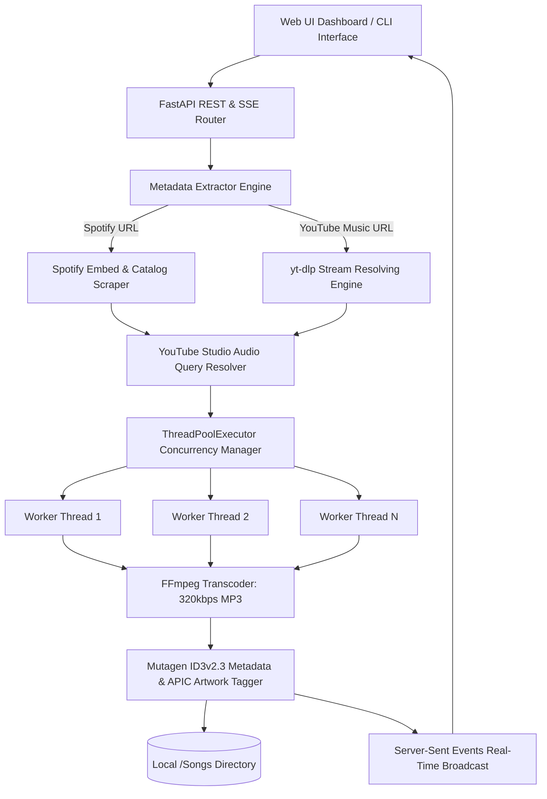
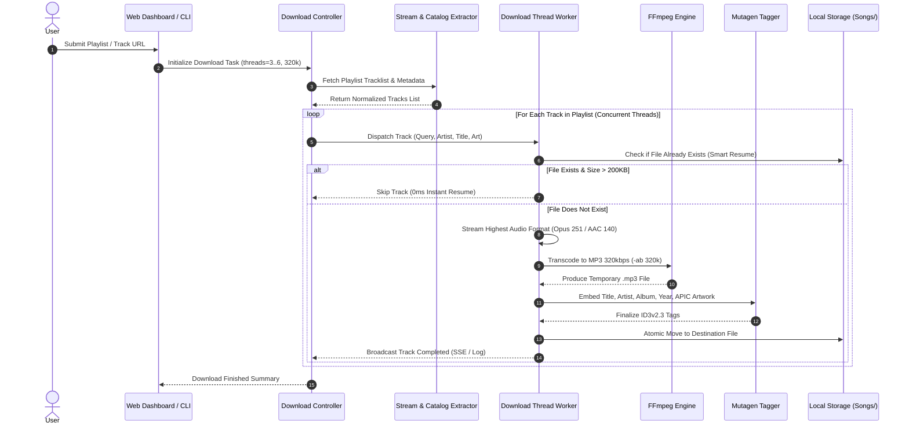
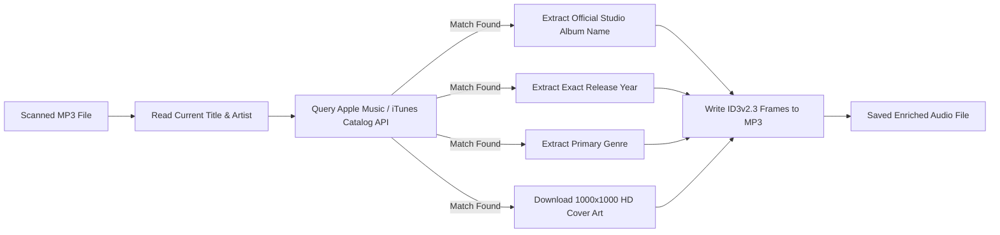

# Technical Architecture & Pipeline Specification

This document details the system design, data flow, concurrency model, and audio processing pipeline of **MusicDownloader**.

---

## 1. System Overview & Technology Stack

### Core Technologies

| Layer | Component | Description |
| :--- | :--- | :--- |
| **Backend & API** | FastAPI + Uvicorn | Async web framework providing REST endpoints and Server-Sent Events (SSE) |
| **Stream Extraction** | `yt-dlp` | Direct audio extraction engine bypassing bot detection and CORS restrictions |
| **Audio Processing** | FFmpeg | High-fidelity audio stream extraction and transcoding to 320 kbps constant/variable bitrate MP3 |
| **Metadata Tagging** | `mutagen` | ID3v2.3 tag writing (`TIT2`, `TPE1`, `TALB`, `TDRC`, `TCON`, `APIC` frame embedding) |
| **Catalog Enrichment**| Apple Music / iTunes Search API | Public API lookup for official studio albums, release dates, genres, and 1000×1000 artwork |
| **Frontend UI** | HTML5 / Vanilla CSS3 / JS | Dark glassmorphism interface with zero heavy frontend bundle dependencies |

---

## 2. Download & Transcoding Pipeline

---

## 3. Key Architectural Components

### A. Title Cleaning & Normalization Engine
Raw YouTube titles frequently contain video noise and redundant metadata. The normalizer processes raw strings through a multi-pass pipeline:
1. **Noise Stripping**: Removes `(Official Video)`, `(Official Audio)`, `[Official Lyric Video]`, `[4K]`, `Remastered`, etc.
2. **Artist Extraction**: Separates `Artist - Title` into structured fields, stripping channel names if uploaded by record labels (e.g. `Vevo`, `Topic`, `Atlantic Records`, `Fueled By Ramen`).
3. **Featuring Artist Migration**: Extracts `ft.`, `feat.`, `featuring` from the song title, cleans the title to pure song name, and moves the guest artist into the primary `TPE1` Artist ID3 tag.

### B. Smart Resume Engine
To ensure efficiency across massive playlists (1,000+ tracks):
- Before dispatching a stream request, the worker checks `os.path.isfile(target_filepath)`.
- Verifies that file size exceeds `200 KB` (confirming an intact audio file).
- If matched, the track is marked as `skipped` in `<0.01ms`, saving bandwidth and CPU cycles.

### C. Concurrency Model
- Implements `concurrent.futures.ThreadPoolExecutor` with configurable worker pools (default: 3–4 workers).
- Download workers execute network I/O and FFmpeg subprocesses concurrently.
- Thread-safe state synchronization is governed via `threading.Lock` primitives.

---

## 4. Metadata Enrichment Flow (`fix_metadata.py`)

1. Reads clean song title and artist from the local file tags.
2. Queries the iTunes Search API (`https://itunes.apple.com/search?media=music&entity=song`).
3. Updates `TALB` (Official Album), `TDRC` (Release Year), `TCON` (Genre), and `APIC` (1000×1000 HD Front Cover Image).
4. Non-destructive: Updates ID3 header frames without altering the audio stream.
